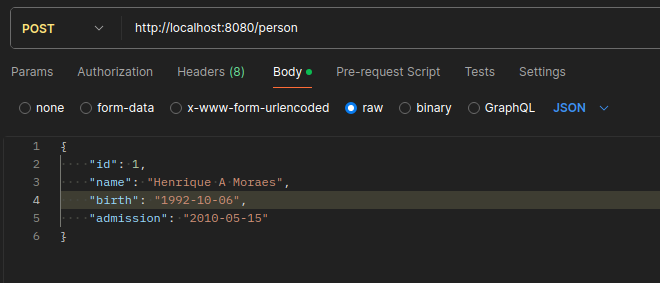
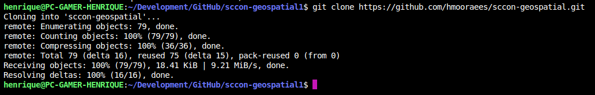
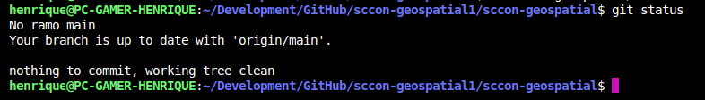
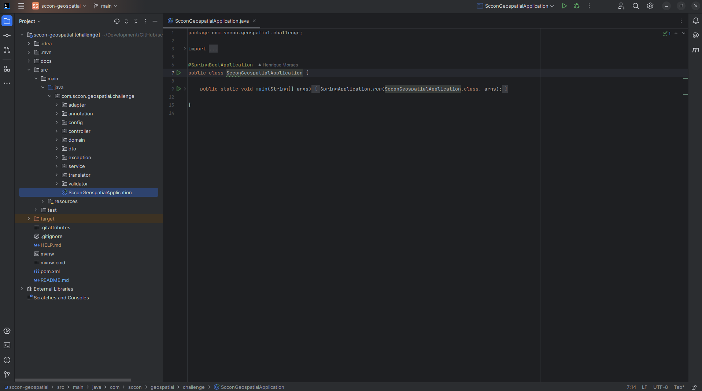
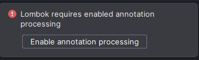
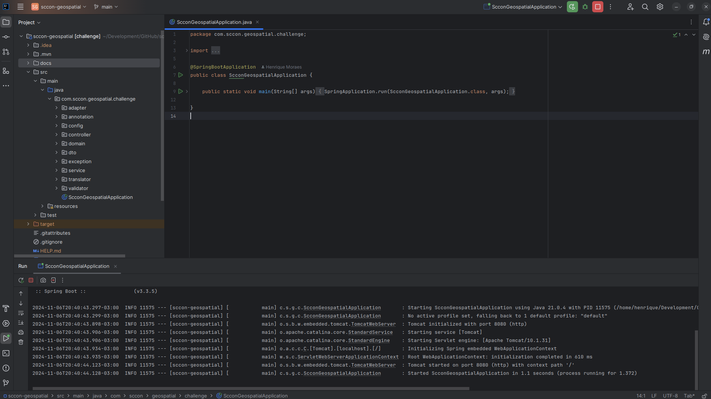

# Documentação do Projeto

## Pré Requisitos do Projeto

- Java 21
- Maven

## Framework e Bibliotecas Utilizadas

- Spring Boot
- Lombok

### Observações:

- Utilização da biblioteca Lombok para otimizar as classes utilizando anotações e ajudar na criação de seus métodos de acesso e construtores, facilitando no build dos DTOs e entidades. Também utilizado para facilitar na observabilidade.
- No caso de problema com dependência, executar o comando ``mvn clean install``.
- Não foi criado testes unitários e de integração.

## Detalhes da Solução

#### O projeto está estruturado na arquitetura MVC padrão. Não foi utilizado arquitetura hexagonal ou clean architecture
- Possui a estrutura default para recebimento, conversão e manipulação dos dados.
- Foi criado um translator para conversão dos DTOs e domains.  
- Mapa em memória sempre inicializado no start da aplicação com 3 objetos fixos, gerenciado através de um ``bean`` do spring.
- Para validação dos dados de entrada do tipo data, foi necessário criar uma ``annotation``, validando o formato no padrão ``yyyy-MM-dd``
- A tratativa dos erros são gerenciadas por ``handlers``, tratando as possíveis ``exceptions`` lançadas.

### Exemplo de Chamada do Endpoint

- Foi utilizado a aplicação Postman para realizar as chamadas:

``URL:`` ``[POST] http://localhost:8080/person``

``Headers:`` ``Content-Type: application/json``

``Body:`` ``{ "id": "number", "name": "string", "birth": "string", "admission": "string" }``

- Observação: Todos os endpoints do requisito foram desenvolvidos. Necessário utilizar os métodos HTTP específicos para cada solicitação.

- Exemplo da chamada ``POST``:

## Requisitos para Execução

- Ter o Git instalado, caso não tenha utilize este <a href="https://git-scm.com/downloads" download>link</a>
- Ter uma IDE instalada, para este exemplo iremos utilizar o IntelliJ IDEA Community Edition, caso não tenha pode baixar no <a href="https://www.jetbrains.com/idea/download/#section=windows">link</a>

### Passo a Passo Para Exacução

1. Realize o clone do projeto através do comando

``git clone https://github.com/hmooraees/sccon-geospatial.git``

2. Como pode ver ele irá realizar o download corretamente na branch **main**

3. Abra o IntelliJ IDEA Community Edition e selecione o botão **Open**

4. Ache nas suas pastas o projeto que acabou de clonar e abra ele

5. Ache a classe de inicialização conforme demonstrado e clique no botão verde de **Play**

6. No caso de algum problema de compilação por dependência, executar a ação **Maven > Reload project** clicando com o botão direito no arquivo ``pom.xml``, e na sequência executar novamente o comando ``mvn clean install``

7. Este projeto utiliza Lombok, caso apareça uma janela pedindo para habilitar, clique em **Enable**

8. O projeto deve subir sem nenhum problema

